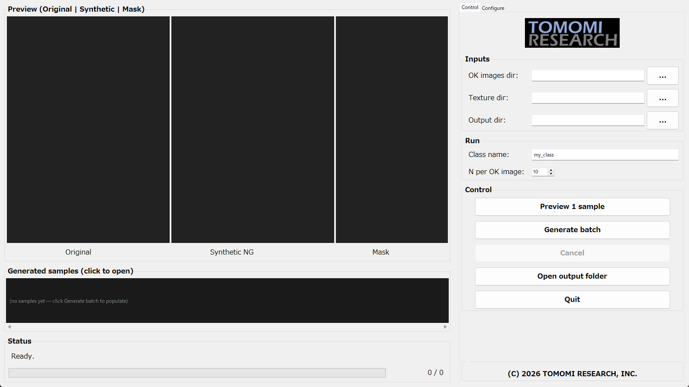
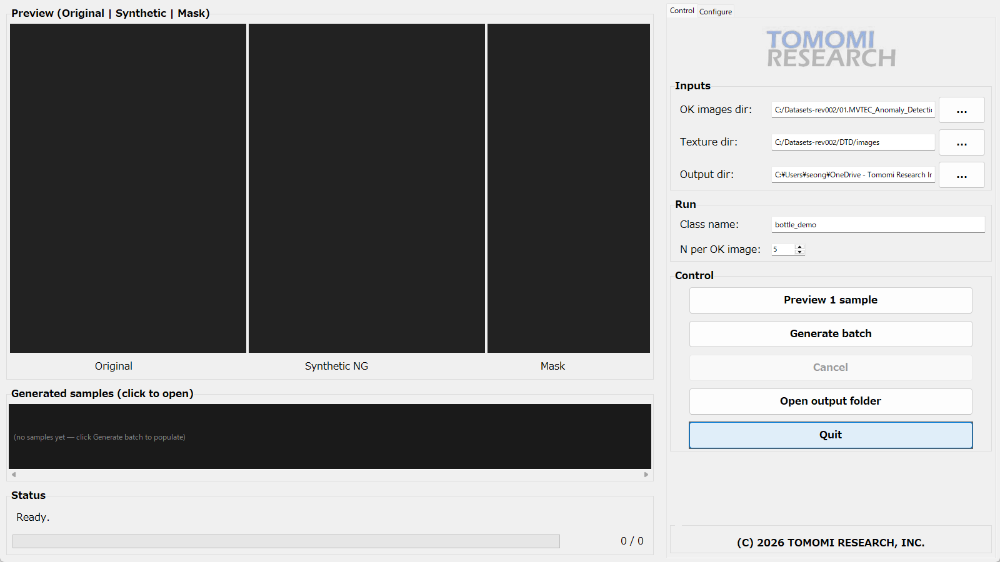
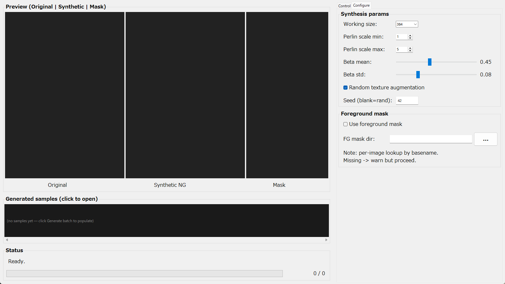
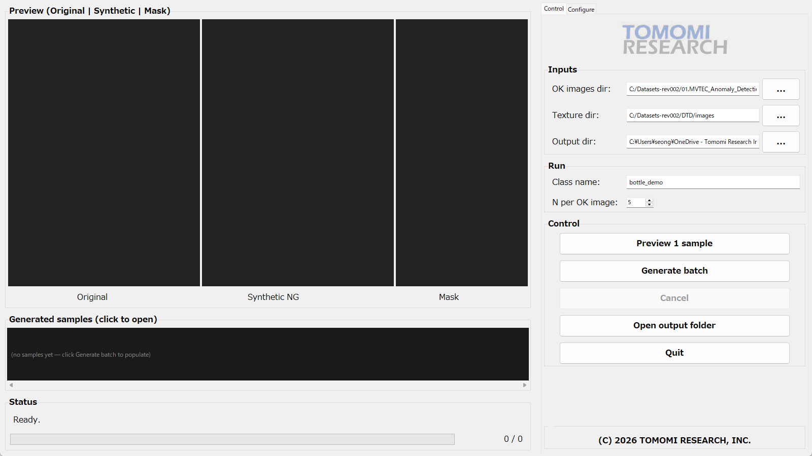
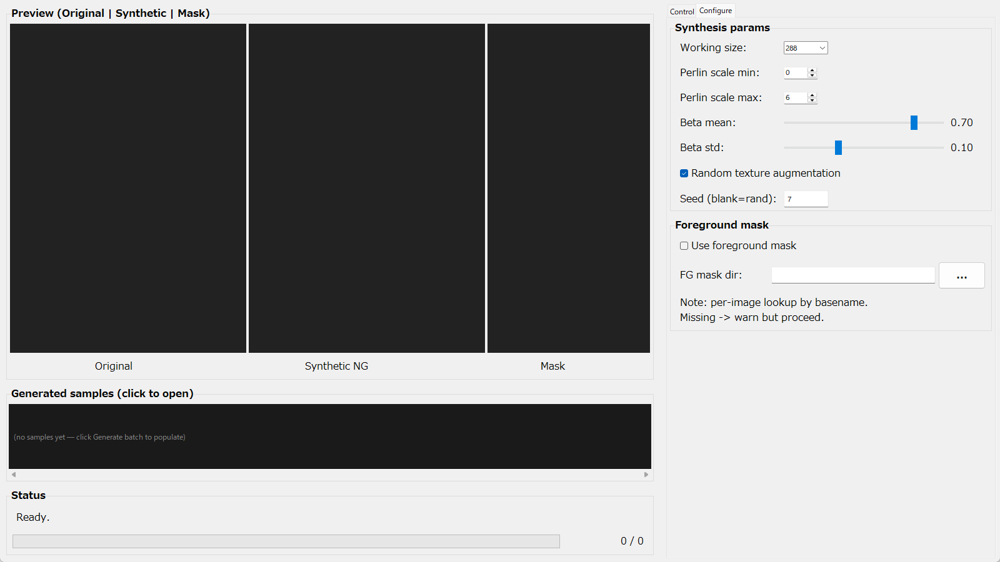

# GLASS Synthesizer ユーザーマニュアル

**対象アプリ**: `synthesize_gui/`（01.GLASS 直下、GLASS LASブランチを利用したNGデータ合成GUIアプリ）
**バージョン**: Phase 5 完了時点（2026-05-02）
**動作環境**: Windows 11 / Python 3.9 (`glass_env`)

---

## 目次

1. [概要](#1-概要)
2. [起動方法](#2-起動方法)
3. [画面構成](#3-画面構成)
4. [Control タブ — 入力・実行ウィジェット](#4-control-タブ--入力実行ウィジェット)
5. [Configure タブ — 合成パラメータウィジェット](#5-configure-タブ--合成パラメータウィジェット)
6. [プレビュー領域とサムネイルストリップ](#6-プレビュー領域とサムネイルストリップ)
7. [典型的なワークフロー](#7-典型的なワークフロー)
8. [出力ファイル構造](#8-出力ファイル構造)
9. [トラブルシューティング](#9-トラブルシューティング)

---

## 1. 概要

GLASS Synthesizerは、**OK画像**（正常品）と**テクスチャ画像**（DTDなど）から、AI異常検知モデルの学習データとして使える**NG画像（合成異常画像）**と**ピクセル単位の二値マスク**を生成するデスクトップアプリです。

合成アルゴリズムは [GLASS (ECCV 2024)](https://github.com/cqylunlun/GLASS) の **LAS (Local Anomaly Synthesis)** ブランチを単独で再利用しています：Perlinノイズマスク × ランダムテクスチャを `β ~ N(mean, std)` のブレンド係数で合成します。学習・識別器は使用しません。

出力レイアウトはMVTec互換なので、PatchCore / EfficientAD などの下流モデルにそのまま投入可能です。

---

## 2. 起動方法

`glass_env` の Python から `synthesize_gui.gui_main` を起動します。

```bash
# synthesize_gui/ を含むフォルダ（01.GLASS/）に cd してから
"C:/Users/seong/anaconda3/envs/glass_env/python.exe" -m synthesize_gui.gui_main
```

または、`synthesize_gui/run.bat` をダブルクリックしても起動できます。

---

## 3. 画面構成

起動直後の画面（初期状態）：



ウィンドウは **左右2分割**（PanedWindow）され、

- **左側（重み5）**：プレビュー領域、サムネイルストリップ、ステータスバー、進捗バー
- **右側（重み2）**：`Control` / `Configure` の2タブ構成のサイドパネル

最上部のタブ切り替えで `Control` と `Configure` を行き来します。

---

## 4. Control タブ — 入力・実行ウィジェット

`Control` タブには、**フォルダ指定**・**実行パラメータ**・**操作ボタン**の3グループが配置されています。

### 4.1 Inputs グループ（フォルダ3点）

各行は `ラベル + Entry + ...ボタン` の構成です。

| ウィジェット | 用途 | 操作方法 |
|---|---|---|
| **OK images dir** | 正常品（OK）画像が入ったフォルダ | `...` ボタン → フォルダ選択ダイアログで指定 |
| **Texture dir** | 異常テクスチャの素材フォルダ（DTD r1.0.1 や社内不良写真） | 同上。サブフォルダも再帰探索 |
| **Output dir** | 合成画像の書き出し先ルート（MVTecレイアウトが自動生成される） | 同上。存在しないパスを指定すると `Generate batch` 時に作成 |

`...` ボタンを押すと標準のフォルダ選択ダイアログが開き、選んだパスがEntryに反映されます。Entryに直接タイプして編集することも可能です。

### 4.2 Run グループ（クラス名 / 1枚あたり生成枚数）

| ウィジェット | デフォルト | 説明 |
|---|---|---|
| **Class name** (Entry) | `my_class` | MVTecレイアウトの最上位フォルダ名。例：`bottle`, `bracket_brown` |
| **N per OK image** (Spinbox) | `10` | OK画像1枚あたり何枚のNGを合成するか。範囲: 1–200 |

3つのフォルダとClass name / N per OK imageを入力した状態：



### 4.3 Control グループ（5つのアクションボタン）

| ボタン | スタイル | 動作 |
|---|---|---|
| **Preview 1 sample** | primary | OK・テクスチャ各フォルダから1枚ずつランダム選択し、左プレビューに `Original / Synthetic NG / Mask` を表示。出力は書き込まない |
| **Generate batch** | primary | OK画像 × N枚分のNGを一括合成し、Output dirへMVTecレイアウトで保存。バックグラウンドスレッドで動作 |
| **Cancel** | secondary | 実行中のバッチ生成を中断（生成済みファイルは保持） |
| **Open output folder** | secondary | エクスプローラでOutput dirを開く |
| **Quit** | secondary | アプリを終了。バッチ実行中は確認ダイアログで離脱可否を尋ねる |

`Cancel` は通常時グレーアウトし、`Generate batch` 開始時のみ有効化されます。

---

## 5. Configure タブ — 合成パラメータウィジェット

`Configure` タブはより詳細な合成パラメータを調整します。**初回 `Preview 1 sample` 実行後**は、これらのウィジェット変更が **200 ms デバウンスでライブプレビュー** に反映されます。

### 5.1 Synthesis params グループ（既定値）


| ウィジェット | 種類 | 範囲 | 既定値 | 効果 |
|---|---|---|---|---|
| **Working size** | Combobox（読み取り専用） | 256 / 288 / 320 / 384 / 512 | `288` | LAS内部で計算する正方解像度。出力は元画像のアスペクト比へリサイズして戻る |
| **Perlin scale min** | Spinbox | 0–4 | `0` | Perlin マスクの最小スケール指数 (`2**min`)。値が小さいほど細かい欠陥 |
| **Perlin scale max** | Spinbox | 1–7 | `6` | 最大スケール指数 (`2**max`)。値が大きいほど大きな塊状欠陥 |
| **Beta mean** | Scale + 数値ラベル | 0.20–0.80 | `0.50` | テクスチャと元画像のブレンド係数 `β` の中心値。`β` は `[0.2, 0.8]` でクリップ |
| **Beta std** | Scale + 数値ラベル | 0.00–0.30 | `0.10` | `β` のばらつき |
| **Random texture augmentation** | Checkbutton | – | `ON` | テクスチャ画像に色味・反転・アフィンのランダム3op augを掛けてから合成 |
| **Seed (blank=rand)** | Entry | 整数 / 空 | 空 | 空 → 呼び出しごとにランダム。整数 → `_seed_all(seed + sample_idx)` でバッチを再現可能 |

各ウィジェットを操作すると、

1. 内部の Tk 変数が更新される
2. `on_param_change()` が呼ばれ、200 ms 後に直前の OK / texture ペアを使ってライブ再合成
3. プレビュー領域が再描画される

例として、`Working size=384`、`Perlin scale 1–5`、`Beta mean=0.45`、`Seed=42` に変更した状態：



#### Beta mean / Beta std スライダーの操作

スライダーをドラッグすると右側の数値ラベルがリアルタイムに更新され、ドラッグ終了後（連続イベントの最後）に200 msデバウンスでライブプレビューが再合成されます。

#### Spinbox の操作

`Perlin scale min/max` の Spinbox は上下矢印クリックでも、Entryに直接タイプしてもOKです。値を変えるたびに同じくライブ再合成が走ります。

### 5.2 Foreground mask グループ

| ウィジェット | 動作 |
|---|---|
| **Use foreground mask** (Checkbutton) | ONにすると、合成時に前景マスクで欠陥領域をAND制約 |
| **FG mask dir** (Entry + `...`) | 前景マスクが入ったフォルダ。**OK画像のbasenameと同じファイル名**で照合（拡張子は png/jpg/jpeg/bmp/tif のいずれかを自動探索） |

注意：

- 該当OK画像に対応するマスクが見つからない場合、警告を出して**そのサンプルだけ前景マスクOFFで合成**します（処理は止まりません）。
- フォルダだけ指定してチェックボックスがOFFのままなら、前景マスクは使われません。

---

## 6. プレビュー領域とサムネイルストリップ

### 6.1 3面プレビュー（Original / Synthetic NG / Mask）

`Preview 1 sample` ボタン（または Configure タブのライブプレビュー）を実行すると、左側に3つのキャンバスが描画されます：

- **Original**: 選ばれたOK画像
- **Synthetic NG**: 合成後の異常画像（BGR）
- **Mask**: 二値マスクをJETカラーマップで可視化

例：MVTec `bottle/train/good/101.png` × DTD `studded_0210.jpg` を合成した結果。



ステータスバー下部に `src=...` `tex=...` `beta=...` `ws=...` `perlin=[min,max]` `fg=on/off` の合成情報が表示されます。

Configure タブでスライダー（Beta meanなど）を動かした直後の画面（左側のプレビューが新しい合成結果に更新されている）：



### 6.2 Generated samples（サムネイルストリップ）

`Generate batch` 実行中、合成された各サンプルが下のサムネイルストリップに小さく追加されていきます（最新が右端、1サンプルずつスクロール領域が拡張）。

- 各サムネイルを**クリック**すると、対応する Original / Synthetic NG / Mask の組が3面プレビューに再描画されます。
- 上限は `STRIP_CAP=300` 件。それ以上はFIFOで古いものから破棄されます（Tkの描画パフォーマンス保護）。
- マウスホイールで横スクロール、下のスクロールバーでもスクロール可能。

### 6.3 Status / Progress

- **Status** ラベル：直近の操作結果や警告を1行表示。
- **Progress bar**：`Generate batch` 中、`現在の枚数 / 全体枚数` の形で進捗を表示（5枚ごとに更新）。

---

## 7. 典型的なワークフロー

### 7.1 1サンプルだけプレビューして合成パラメータを確認する

1. Control タブで OK images dir / Texture dir を指定（Output dir は不要）。
2. **Preview 1 sample** をクリック。
3. 結果を見て、Configure タブで `Beta mean` や `Perlin scale max` をスライダー / Spinbox で調整。
4. ライブプレビューが200 msごとに自動更新される。
5. 気に入った設定が見つかったら次節へ。

### 7.2 バッチ生成して下流学習に使う

1. Control タブで OK / Texture / Output の3フォルダ、`Class name`、`N per OK image` を入力。
2. Configure タブでパラメータを調整（再現性が必要なら `Seed` に整数を入力）。
3. **Generate batch** をクリック。
4. 進捗バーとサムネイルストリップで進行を確認。中断したい場合は **Cancel**。
5. 完了ダイアログで `run.json` のパスを確認。
6. **Open output folder** で生成先を開く。

### 7.3 既存出力ディレクトリへ追記する

`Output dir` に既に `0000.png ... NNNN.png` がある場合、Exporter が最大番号を読み取り `NNNN+1` から続きの番号で書き込みます。同じクラスに対し追加サンプルを増やしたい時に便利です。

---

## 8. 出力ファイル構造

`Generate batch` 完了後、`<Output dir>/<Class name>/` 配下は以下のMVTec互換構造になります：

```
<Output dir>/<Class name>/
├── train/good/                        # OK画像（コピー）
│   ├── 000.png
│   └── ...
├── test/synthetic/                    # 合成NG画像
│   ├── 0000.png
│   └── ...
├── ground_truth/synthetic/            # 二値マスク（0/255）
│   ├── 0000_mask.png
│   └── ...
└── run.json                           # 実行パラメータと各サンプルのメタデータ
```

`run.json` には `SynthParams` のフルダンプと、各サンプルごとに `(source_image, texture_path, beta, seed)` の対応が記録されます。再現実験や監査用ログとして利用できます。

---

## 9. トラブルシューティング

| 症状 | 原因 | 対処 |
|---|---|---|
| `OK images folder is not set or does not exist` | Inputsのパスが空 / 不正 | `...` ボタンで再選択 |
| `No images found in OK folder` | フォルダ内に画像（png/jpg/bmp/tif等）がない / サブフォルダのみ | OK画像はフラットに置くか、フラットがなければ再帰検索する |
| `working_size must be divisible by downsampling` | Comboboxの値を直接編集して8の倍数でない値にした | プリセット（256/288/320/384/512）から選択 |
| ライブプレビューが反応しない | 1度も `Preview 1 sample` を実行していない | まずControlタブから1枚プレビューを実行 |
| Beta値がスライダー位置と合っていないように見える | スライダーは `mean`、実際の `β` は `N(mean, std)` のサンプル | これは仕様。`Beta std=0` にすれば一致 |
| `WARN: no fg mask for ...` | 前景マスクOFFで合成された | FGマスクのファイル名がOK画像basenameと一致しているか確認 |
| 終了時に確認ダイアログ | `Generate batch` 実行中 | 「Quit anyway?」でOKすればキャンセル後終了。書き込み済みは保持 |

---

## 付録: 関連ドキュメント

- 設計と決定事項: `00.docs/GLASS_synth_gui_plan.md`
- 上流GLASS論文: `00.docs/2407.09359v1.pdf`
- スタンドアロン公開リポジトリ: https://github.com/kotai2003/glass-synthesizer-app
- 内部スタイルガイド: `skills/tomomi-gui-style/SKILL.md`

---

(C) 2026 TOMOMI RESEARCH, INC.
